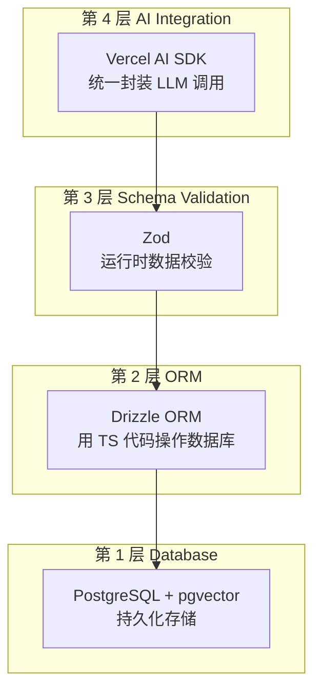
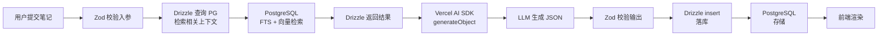

# 2026-08-09 Agent 全栈技术栈：从数据库到 AI 框架的四层分工

一个 Agent 请求，从用户输入到数据落库，经过了几层？每层管什么、选了什么工具、互相什么关系？如果你搞不清 PostgreSQL、Drizzle、Zod、Vercel AI SDK 各自的职责边界，代码就会乱成一团。

## 四层架构总览

Agent 全栈技术栈分为四层，每层职责独立、工具不同：



## 逐层拆解

### 第 1 层：Database（数据存储）

**是什么**：真正把数据写进磁盘的地方。不关心你的代码用什么语言写，只管存什么类型的数据。

**管什么**：持久化存储文本、向量和 JSON 数据；提供查询能力（SQL 精确查询、向量相似度检索、全文检索）。

**不管什么**：不管你的 TypeScript 类型、不管你的 API 参数校验、不管你的 LLM 调用方式。

**本营选型**：PostgreSQL + pgvector。

- **PostgreSQL**：开源关系型数据库，原生支持数组、JSON、枚举等丰富数据类型
- **pgvector**：PostgreSQL 扩展，使库内可存储 Embedding 向量并做相似度检索

**同类/备选**：MySQL（不支持 pgvector）、SQLite（轻量）、Pinecone / Qdrant / Milvus（专用向量库）

### 第 2 层：ORM（代码操作数据库）

**是什么**：Object-Relational Mapping（对象关系映射）。让你用 TypeScript 代码操作数据库，不用手写原始 SQL。

**管什么**：把 `db.insert(notes).values(...)` 翻译成 `INSERT INTO notes VALUES (...)`；管理表结构定义（Schema）；提供类型安全的查询接口。

**不管什么**：不管数据内容是否合法（那是 Zod 的活）、不管 LLM 怎么调用、不管前端怎么渲染。

**本营选型**：Drizzle ORM。

- 轻量、TypeScript 优先、不引入额外运行时
- 支持 pgvector 的 `vector` 类型
- Schema 定义即 TS 类型，`z.infer` 式类型推导

**同类/备选**：Prisma（功能更全但更重）、Kysely（纯查询构建器）、TypeORM

**Java 对应**：MyBatis / Hibernate / JPA。**Python 对应**：SQLAlchemy / Peewee。

### 第 3 层：Schema Validation（运行期数据校验）

**是什么**：运行时数据校验库。在代码运行时拦截不符合 Schema 的数据，防止脏数据撞毁系统。

**管什么**：校验 LLM 输出的 JSON 是否合规；校验 API 入参是否合法；校验 Tool 参数是否正确；校验环境变量是否配置。

**不管什么**：不管数据怎么存（那是 Drizzle 的活）、不管数据怎么查（那是 PG 的活）、不管 LLM 怎么调用。

**本营选型**：Zod。

- TypeScript-first，定义 Schema 即推导类型
- 与 Vercel AI SDK / OpenAI SDK 原生集成
- `z.object({...}).parse(data)` 运行时校验 + `z.infer<typeof Schema>` 编译期类型

**同类/备选**：Valibot（更轻量）、TypeBox（JSON Schema 优先）。

**Java 对应**：Hibernate Validator / `@NotNull` / JSR-303。**Python 对应**：Pydantic。

> Zod 在 Agent 全链路中有 6 个校验场景，详见 [Zod 全生命周期](../../method/2026-08-09_方法_Zod全生命周期.md)。

### 第 4 层：AI Integration（LLM 与 Agent 框架）

**是什么**：统一封装 LLM 调用、Tool Call 与结构化输出的框架层。

**管什么**：抹平不同 LLM 厂商（OpenAI / Claude / Gemini）的 API 差异；标准化 Tools 定义；提供 `generateObject` / `streamObject` 等结构化输出 API；原生支持 Next.js 流式 UI。

**不管什么**：不管数据怎么存、不管数据格式校验（交给 Zod）、不管数据库连接池管理。

**本营选型**：Vercel AI SDK（`ai` + `@ai-sdk/openai` 包）。

**同类/备选**：LangChain（更重，偏 Python 生态）、LlamaIndex（检索优先）。

**Java 对应**：Spring AI / LangChain4j。**Python 对应**：LangChain / LlamaIndex / AutoGen。

## PostgreSQL 数据类型详解

PostgreSQL 是 Agent 全栈的底层存储。理解它的数据类型，是设计 AI 业务表结构的基础。

### 数值类型

| 类型 | 存储大小 | 范围 | 用途 |
|------|---------|------|------|
| `smallint` / `int2` | 2 字节 | -32768 ~ 32767 | 小范围整数 |
| `integer` / `int4` | 4 字节 | -21 亿 ~ 21 亿 | 最常用，分数、计数 |
| `bigint` / `int8` | 8 字节 | ±9.2 × 10¹⁸ | 大计数 |
| `real` / `float4` | 4 字节 | 6 位小数精度 | 近似浮点数 |
| `double precision` / `float8` | 8 字节 | 15 位小数精度 | 高精度浮点 |
| `numeric(p,s)` / `decimal(p,s)` | 可变 | 任意精度 | 金额、精确计算 |
| `serial` | 4 字节 | 自增整数 | 自增主键 |
| `bigserial` | 8 字节 | 自增大整数 | 大表自增主键 |

**Agent 场景**：`integer` 存掌握度分数（0-100）；`serial` 存自增 ID；`numeric` 存 Token 用量成本。

### 字符类型

| 类型 | 说明 | 用途 |
|------|------|------|
| `text` | 变长，无长度限制 | 最常用，存主题名、笔记内容 |
| `varchar(n)` | 变长，最多 n 字符 | 需要限制长度时用 |
| `char(n)` | 定长，不足补空格 | 几乎不用，特定场景（如固定编码） |

**Agent 场景**：`text` 存 LLM 生成的笔记内容、问题描述、解析文本。

### 日期时间类型

| 类型 | 说明 | 用途 |
|------|------|------|
| `timestamp` | 日期+时间，不带时区 | 本地时间 |
| `timestamptz` | 日期+时间，带时区 | **推荐**，避免时区混乱 |
| `date` | 仅日期 | 生日、计划日期 |
| `time` | 仅时间 | 每日提醒时间 |
| `interval` | 时间间隔 | 计算时长 |

**Agent 场景**：`timestamptz` 存 `created_at`、`updated_at`。**始终用 `timestamptz` 而非 `timestamp`**，避免跨时区时数据错乱。

### 布尔类型

`boolean`：三个值——`true`、`false`、`NULL`。用于 `is_published`、`is_active` 等状态标记。

### 枚举类型（pgEnum）

PostgreSQL 原生支持枚举类型，在数据库层限制字段只能存指定的值：

```sql
CREATE TYPE severity AS ENUM ('low', 'medium', 'high');
```

Drizzle 中用 `pgEnum`：

```typescript
const severityEnum = pgEnum('severity', ['low', 'medium', 'high']);
```

**特点**：
- 数据库层硬约束：试图存 `'critical'` 直接报错拒绝
- 适合值集合固定的字段：状态、严重程度、分类
- 添加新值需要 `ALTER TYPE ... ADD VALUE`，不能随意删改

### 数组类型

PostgreSQL 是少数原生支持数组的数据库。任何基础类型都可以变成数组：

| 类型 | 示例 | 用途 |
|------|------|------|
| `text[]` | `['向量计算', 'Rerank', 'pgvector']` | 字符串列表（标签、盲区） |
| `integer[]` | `[1, 2, 3]` | 整数列表（ID 集合） |
| `jsonb[]` | `[{...}, {...}]` | JSON 对象数组（不常用，通常直接用 jsonb 存数组） |

Drizzle 中用 `.array()`：

```typescript
keyGaps: text('key_gaps').array().notNull()
```

**查询**：`'向量计算' = ANY(key_gaps)` 判断数组中是否包含某值。

### JSON 类型：json vs jsonb

PostgreSQL 提供两种 JSON 类型：

| | `json` | `jsonb` |
|--|---------|---------|
| **存储方式** | 原始文本存储 | 二进制解析格式存储 |
| **保留输入** | 保留空格和键顺序 | 不保留 |
| **索引支持** | 不支持 | 支持 GIN 索引 |
| **查询性能** | 每次解析 | 预解析，快 |
| **键顺序** | 保留 | 不保留 |
| **去重** | 不去重 | 自动去重（同名键只保留最后一个） |
| **Agent 场景** | 几乎不用 | **首选**，存 LLM 生成的嵌套结构 |

Drizzle 中用 `jsonb` + `.$type<T>()` 泛型做类型约束：

```typescript
quizQuestions: jsonb('quiz_questions').$type<Array<{
  id: string;
  question: string;
  options: string[];
  correctAnswerIndex: number;
  explanation: string;
}>>().notNull(),
```

**jsonb 查询**：
- `quiz_questions @> '[{"id": "q_1"}]'`：判断是否包含指定元素
- `quiz_questions ? 'key'`：判断键是否存在
- 支持 GIN 索引加速 JSON 查询

### UUID 类型

`uuid`：128 位（16 字节）唯一标识符。PostgreSQL 14+ 可用 `gen_random_uuid()` 生成。

```typescript
id: uuid('id').defaultRandom().primaryKey(),
```

**Agent 场景**：主键。比 `serial` 更适合分布式场景，且不暴露自增序列信息。

### 向量类型（pgvector）

`vector(n)`：n 维浮点数向量，由 pgvector 扩展提供。

```typescript
embedding: vector('embedding', { dimensions: 1536 }),
```

**相似度操作符**：

| 操作符 | 含义 | 公式 |
|--------|------|------|
| `<->` | 欧几里得距离（L2） | $\sqrt{\sum_{i=1}^{n}(a_i - b_i)^2}$ |
| `<=>` | 余弦距离 | $1 - \frac{A \cdot B}{\|A\| \|B\|}$ |
| `<#>` | 负内积 | $-(A \cdot B)$ |

**Agent 场景**：存 Embedding 向量（如 OpenAI `text-embedding-3-small` 的 1536 维输出）。配 HNSW 索引可做毫秒级语义检索。

### 全文检索类型

| 类型 | 说明 |
|------|------|
| `tsvector` | 分词后的词列表（排序去重） |
| `tsquery` | 搜索词查询 |

这是 PostgreSQL 混合检索（Hybrid Search）中 FTS 通道的底层支撑。

## 跨生态映射表

四层架构在不同语言生态中的工具对应：

| 架构分层 | 职责 | Node.js / TS（本营） | Java 生态 | Python 生态 |
|---------|------|---------------------|----------|------------|
| Database | 持久化存储 | PostgreSQL + pgvector | PostgreSQL / MySQL | PostgreSQL / Qdrant |
| ORM | 代码操作数据库 | Drizzle ORM | MyBatis / Hibernate | SQLAlchemy |
| Schema Validation | 运行时校验 | Zod | Hibernate Validator | Pydantic |
| AI Integration | LLM 调用与结构化输出 | Vercel AI SDK | Spring AI / LangChain4j | LangChain / LlamaIndex |

## 数据流全链路

一次完整的 Agent 请求，数据如何流经四层：



1. **用户提交笔记** → Zod 校验 API 入参（第 3 层）
2. **检索上下文** → Drizzle 查 PostgreSQL（第 2→1 层），FTS + 向量检索
3. **LLM 生成** → Vercel AI SDK 的 `generateObject`，传入 Zod Schema（第 4→3 层）
4. **校验输出** → Zod 二次校验 LLM 返回（第 3 层）
5. **数据落库** → Drizzle `db.insert()` 写入 PostgreSQL（第 2→1 层）
6. **前端渲染** → 强类型数据直接渲染为 React 组件

## 关键辨析

### PostgreSQL vs pgvector

| | PostgreSQL | pgvector |
|--|-----------|----------|
| 是什么 | 数据库本体 | 扩展插件 |
| 管什么 | 存储、事务、SQL 查询 | 向量存储与相似度检索 |
| 关系 | pgvector 是 PostgreSQL 的扩展，不是独立数据库 |

### Drizzle vs Zod

| | Drizzle | Zod |
|--|---------|-----|
| 约束对象 | 数据库表结构 | 动态数据（LLM 输出、API 输入） |
| 角色比喻 | 建模师 / 施工图 | 门卫 / 质检员 |
| 何时用 | 定义表结构、执行查询 | 校验动态数据格式 |

### Zod vs Drizzle Schema

两者都叫 "Schema"，但约束的东西不同：Zod 约束的是"数据形状对不对"（运行时），Drizzle 约束的是"数据怎么存"（定义时）。LLM 生成 → Zod 校验 → Drizzle 写入，串联起来就是端到端类型安全。

## 一句话带走

数据库管存储、ORM 管翻译、Zod 管校验、AI SDK 管调用。四层各司其职，串联起来就是端到端类型安全。

## 参考来源

- [PostgreSQL 数据类型文档](https://www.postgresql.org/docs/current/datatype.html) — 全部原生类型定义
- [PostgreSQL JSON 类型文档](https://www.postgresql.org/docs/current/datatype-json.html) — json vs jsonb 差异
- [PostgreSQL 枚举类型文档](https://www.postgresql.org/docs/current/datatype-enum.html) — CREATE TYPE ... AS ENUM
- [pgvector GitHub](https://github.com/pgvector/pgvector) — vector 类型与相似度操作符
- [Drizzle ORM 文档](https://orm.drizzle.team) — TS 优先的 ORM
- [Zod 官方文档](https://zod.dev) — 运行时数据校验
- [Vercel AI SDK 文档](https://ai-sdk.dev) — AI Integration 层

## 相关

- [Structured Output](./2026-08-09_概念_StructuredOutput.md) — AI Integration 层深入：Grammar-Guided Sampling
- [Zod 全生命周期](../../method/2026-08-09_方法_Zod全生命周期.md) — Schema Validation 层深入：6 个校验场景
- [Agent 数据库设计](../../method/2026-08-09_方法_Agent数据库设计.md) — Database 层深入：三种数据形态与表设计
