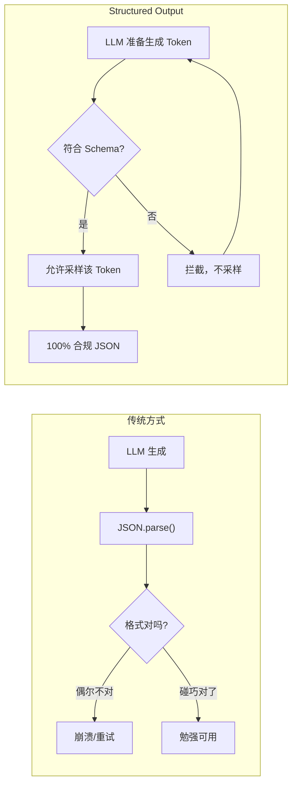
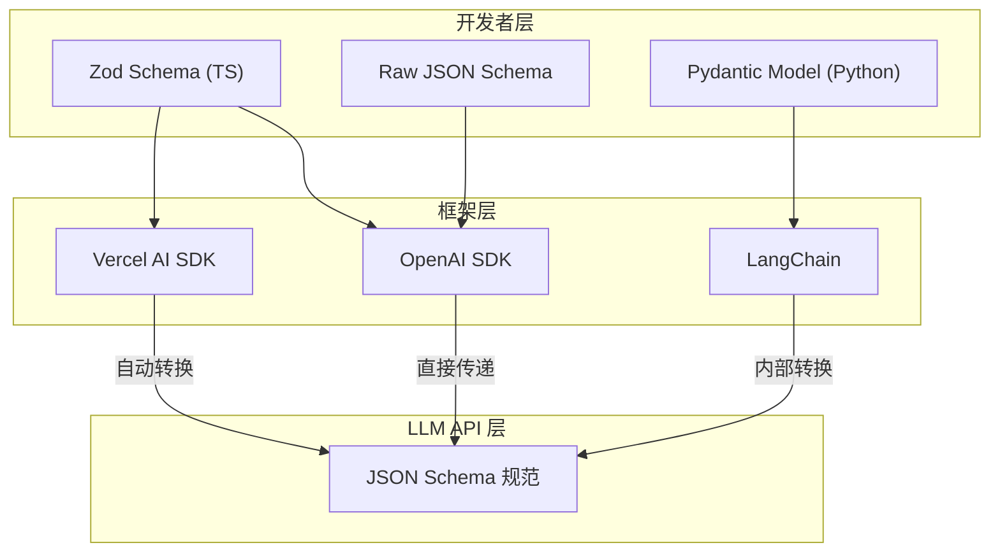

你跟 LLM 说"请严格返回 JSON 格式"，它偶尔给你加个 ` ```json ` 代码块，或者把数组字段返回成逗号分隔的字符串。`JSON.parse()` 直接崩溃。

这不是 LLM 不听话。是你用的约束手段不对。

## 纯 Prompt 约束的三大缺陷

在早期 Agent 开发中，开发者常用 Prompt 强行要求 LLM 输出 JSON。但生产环境中存在三个无法根治的问题：

| 缺陷 | 表现 | 后果 |
|------|------|------|
| **幻觉与语法错误** | 偶尔遗漏双引号、多写尾随逗号、加 `json ...` 代码块 | `JSON.parse()` 抛异常，整个请求崩溃 |
| **字段类型漂移** | 本应是 `string[]`，LLM 返回逗号分隔的 `string` | 下游代码 `array.map()` 报错，但语法是合法 JSON |
| **无物理层保障** | Prompt 是"建议"不是"约束"，LLM 可以无视 | 只能事后 try-catch + 重试，永远无法 100% 杜绝 |

核心问题在于：**Prompt 约束发生在概率层，不是物理层。** LLM 生成每个 Token 时，采样器根据概率分布选词，Prompt 只是在影响概率分布，不是在硬性拦截。

要理解 Structured Output 怎么做到物理层拦截，需要先看清 LLM 输出一个 Token 经过的完整管线：

1. **Hidden State（隐状态向量）**：Transformer 多层 Self-Attention 计算后，最后一层产出一个高维上下文向量 $h_{last}$——它凝聚了前面所有文本的语义与逻辑。
2. **Logits（点积 = 方向相近度）**：LM Head 将 $h_{last}$ 与全词表中每个 Token 的权重向量 $v_i$ 做**点积**。几何本质是：$h_{last}$ 与 $v_i$ 的方向越一致（夹角越小），点积 Logit$_i$ 越大——这个 Token 就越可能是模型的"意图"。
3. **Softmax → 概率分布**：Logits 经 Softmax 归一化为全词表概率分布（所有 Token 的概率之和为 1）。
4. **采样**：采样器根据 Temperature / Top-k / Top-p 参数，从概率分布中选出一个 Token。

> **Structured Output 的拦截点就在第 4 步**：采样器在从概率分布中选词之前，先用 JSON Schema 检查——这个 Token 放进当前序列会不会破坏 JSON 结构？如果会，直接把该 Token 的概率置零，不采样。不合法的 Token **根本不会被生成出来**。

## Grammar-Guided Sampling：Token 采样时的物理拦截

Structured Outputs 的底层机制叫 **Grammar-Guided Sampling（基于语法的采样约束）**。它不是"生成后再校验"，而是"生成时即拦截"：



模型在生成每个 Token 的瞬间，底层引擎根据传入的 JSON Schema 检查：这个 Token 会不会破坏 JSON 结构？如果会，直接拦截，不采样。不合法的 Token **根本不会被生成出来**。

这意味着：100% 符合 Schema 规范，不是概率性的"通常符合"，而是物理层面的"不可能不符合"。

> OpenAI 于 2024 年 8 月推出 Structured Outputs 功能，通过 `response_format: { type: "json_schema", json_schema: {...} }` 参数启用。底层采用 constrained decoding（约束解码）技术，在 Token 采样阶段限制输出空间。详见 [OpenAI 官方文档](https://platform.openai.com/docs/guides/structured-outputs)。

## JSON Schema：所有框架的共同底座

底层大模型 API（OpenAI、Anthropic 等）原生只认 **JSON Schema 规范**。你在不同框架里看到的 `schema` 字段，本质上都是在做同一件事：上层封装 → 转 JSON Schema → 传给 LLM API。



**Schema 的本质**：对数据"形状"与"约束"的元数据描述。它告诉 LLM "你必须且只能输出符合这个结构的数据"——包含哪些 key、每个 key 是什么类型、是否必填、取值范围。

## 跨框架对比：schema 字段都长什么样

几乎所有主流 AI 框架在处理结构化输出时，都有 `schema`（或 `response_format` / `parameters`）这个字段：

| 框架 | 字段名 | 预期输入 | 底层转换 |
|------|--------|---------|---------|
| **OpenAI 原生 SDK** | `response_format` | JSON Schema 对象，或 Pydantic / `zodResponseFormat` | 直接传 JSON Schema |
| **Vercel AI SDK** | `schema` | Zod Schema 对象 | 自动调用 `.jsonSchema` 转 JSON Schema |
| **LangChain** | `.withStructuredOutput(schema)` | Zod / Pydantic / Raw JSON Schema | 内部转换为 JSON Schema |

注意一个细节：Vercel AI SDK 的 `schema` 属性直接接收 **Zod 对象**，SDK 在后台自动把它转成 JSON Schema 传给 LLM。你不需要手动转换。

## 代码示例：generateObject + Zod

以"个人学习助手"为例，Agent 分析用户笔记并生成诊断结果：

```typescript
import { generateObject } from 'ai';
import { openai } from '@ai-sdk/openai';
import { z } from 'zod';

// 1. 用 Zod 定义预期结构
const StudyDiagnosisSchema = z.object({
  topic: z.string().describe("核心知识点名称"),
  masteryScore: z.number().min(0).max(100).describe("掌握度分数"),
  keyGaps: z.array(z.string()).describe("知识盲区列表"),
  quizQuestions: z.array(
    z.object({
      id: z.string(),
      question: z.string(),
      options: z.array(z.string()).length(4),
      correctAnswerIndex: z.number().min(0).max(3),
      explanation: z.string(),
    })
  ).length(2).describe("出 2 道测试题"),
});

// 2. 传入 generateObject，schema 属性 = Zod Schema
const { object } = await generateObject({
  model: openai('gpt-4o'),
  schema: StudyDiagnosisSchema,  // ← Schema 通过这里传入
  system: '你是一位严谨的学习导师...',
  prompt: `以下是用户的学习笔记：\n${contextNotes}`,
});

// 3. object 已具备 TypeScript 强类型保障
object.topic;         // string
object.masteryScore;  // number
object.quizQuestions; // Array<{ id, question, options, correctAnswerIndex, explanation }>
```

> **常见误解**：`contextNotes` 是填入 prompt 的文本变量，不是 Schema。Schema 通过 `schema` 属性传入，控制的是输出的结构，不是输入的内容。

底层发生了什么：Vercel AI SDK 把 `StudyDiagnosisSchema` 转成 JSON Schema，请求 API 时附带 `response_format: { type: "json_schema", json_schema: {...} }`，触发 LLM 的 Grammar-Guided Sampling。返回的 JSON 再经过 Zod 的运行期 `parse()` 二次校验，确保万无一失。

## 三大典型应用场景

| 场景 | 解决什么问题 | 代码手段 |
|------|------------|---------|
| **Tool Call 参数校验** | LLM 调用 Tool 时参数不合规 | 为 Tool 的 `parameters` 挂载 Zod Schema |
| **路由与分类决策** | 用户意图分类 + 参数提取，驱动 Handoff | `generateObject` 返回枚举值，驱动状态机跳转 |
| **结果落库与 UI 渲染** | 生成数据匹配 DB 表结构或前端组件 Props | Zod + `generateObject` 全链路类型对齐 |

## 纯 Prompt 约束 vs Structured Output

| | 纯 Prompt 约束 | Structured Output |
|--|--------------|-------------------|
| 保障层 | 概率性（LLM 可能不遵守） | 物理层（Token 采样时拦截） |
| 出错率 | 生产环境偶发崩溃 | 100% 符合 Schema |
| 字段类型 | 可能漂移（string vs string[]） | 严格锁定 |
| 兜底手段 | try-catch + 重试 | 框架原生保障 + Zod 运行期二次校验 |
| 适用场景 | 原型/demo | 生产环境 |

## 一句话带走

Prompt 是建议，Structured Output 是约束。前者影响概率分布，后者在物理层拦截不合规 Token。

## 参考来源

- [OpenAI Structured Outputs 官方指南](https://platform.openai.com/docs/guides/structured-outputs) — Grammar-Guided Sampling / constrained decoding 原理
- [Vercel AI SDK generateObject 文档](https://ai-sdk.dev/docs/reference/ai-sdk-core/generate-object) — `schema` 参数用法
- [Zod 官方文档](https://zod.dev) — Schema 定义与类型推导

## 相关

- [Zod 全生命周期](../../method/2026-08-09_方法_Zod全生命周期.md) — Zod 在 Agent 全链路的 6 个校验场景
- [Agent 数据库设计](../../method/2026-08-09_方法_Agent数据库设计.md) — Structured Output 生成的数据如何落库
- [Agent 全栈技术栈](./2026-08-09_概念_Agent全栈技术栈.md) — 四层架构中 Structured Output 属于 AI Integration 层
