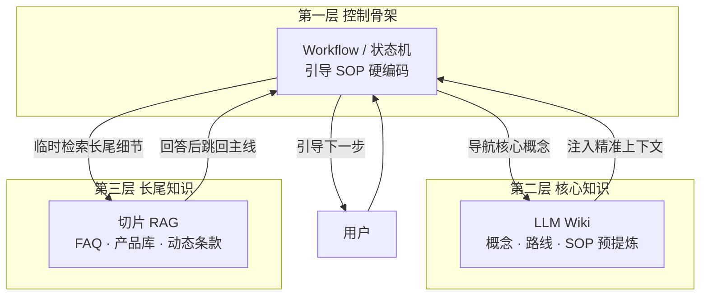

# 2026-08-09 业务转化助手架构：LLM Wiki + RAG 双路知识存储怎么并存

做售前咨询、导购、开户引导这类"业务转化助手"时，最容易掉进一个坑：要么把所有知识都塞进 RAG，结果引导流程顺序混乱；要么把所有知识都写进 Prompt，结果产品库一更新就爆 Token。问题的根源是没有区分知识类型——SOP 和 FAQ 该分开存。

## 为什么纯 RAG 和纯 LLM Wiki 都不够

先看一个业务转化助手需要什么知识：

| 知识类型 | 例子 | 特点 |
|----------|------|------|
| **核心转化逻辑（SOP）** | 打招呼→挖掘需求→推荐方案→解决顾虑→促成下单 | 几千字，逻辑极强，要求 100% 遵守，绝不能出幻觉 |
| **支撑转化的细分知识（FAQ）** | "高血压能投保吗？""A 套餐和昨日活动能叠加吗？" | 1000+ 条，随时在变，长尾查询五花八门 |

这两种知识，用单一方案都有致命问题：

**纯切片 RAG 的问题**：SOP 被切成碎片后，检索可能把"第三步促成下单"和"第一步打招呼"混在一起捞出来。Agent 把引导顺序搞颠倒，转化率直接跳水。RAG 的碎片化在强流程场景里是灾难。

**纯 LLM Wiki 的问题**：1000+ 条产品 FAQ 和 SKU 细节，每天在变。LLM Wiki 每次新增知识都要重新计算双链关联，维护成本极高。而且这些长尾细节不值得花 Token 预提炼。

所以答案是：**两种存储并存，各做擅长的事。**

## 三层架构

### 第一层：Workflow 骨架（控制流）

引导 SOP 硬编码在 Workflow / 状态机 / System Prompt 里。这一层不依赖任何检索，它就是确定性的步骤链：打招呼→挖掘需求→推荐方案→促成转化。确保转化路径不偏航。

这是骨架，Agent 的主循环就在这层跑。用户说什么都不影响下一步该干什么。

### 第二层：LLM Wiki（核心知识）

核心概念、学习路线、业务 SOP 存为结构化 Markdown + 双链。Agent 通过 Wiki 路由或层级向量检索精准定位到整页预提炼知识，注入 LLM。

这层知识的特点是"少而精"——可能只有几千到一万字，但逻辑递进强、关联清晰、要求零幻觉。LLM Wiki 在写入时预提炼的投入是值得的：一次写入，千次精准读取。

### 第三层：切片 RAG（长尾知识）

产品库、FAQ、动态条款存入向量数据库。Agent 把 RAG 作为一个 Function Calling Tool 挂载，当用户在引导流程中偏离主线、问出长尾细节时，临时调用 RAG 工具捞答案，回答完跳回主线。

这层知识的特点是"多而杂"——上千条 SKU、每天变的促销规则、五花八门的用户提问。切片 RAG 写入成本极低，动态更新方便，正好兜底。

## 知识分层设计原则

| 原则 | 做什么 | 为什么 |
|------|--------|--------|
| **强流程不走 RAG** | SOP 硬编码在 Workflow / Prompt | RAG 碎片化会把引导顺序搞乱 |
| **核心概念走 LLM Wiki** | 预提炼 + 双链 + 层级检索 | 零幻觉、全局脉络清晰 |
| **长尾细节走 RAG Tool** | 切片 + 向量 + 混合检索 | 写入低成本、动态更新、海量兜底 |
| **RAG 回答完跳回主线** | Agent 调用完 RAG Tool 后恢复 SOP 状态 | 不能让长尾提问打断转化流程 |

## 两套存储各自的优势

理解它们各自擅长什么，才能决定什么知识放哪层：

| 维度 | LLM Wiki（第二层） | 切片 RAG（第三层） |
|------|---------------------|---------------------|
| **写入成本** | 🐢 高（LLM 提炼+分类+建链） | ⚡ 极低（切块→Embed→入库） |
| **检索质量** | 🧠 全局精准，推理无幻觉 | 局部碎片精确，全局易断章取义 |
| **适合数据** | 少而精（SOP、概念、路线） | 多而杂（FAQ、SKU、动态条款） |
| **更新频率** | 低（半年变一次） | 高（每天变） |
| **在助手中的角色** | 核心知识底座 | 长尾兜底工具 |

这不是"选 A 还是选 B"，而是"A 和 B 各放哪一层"。LLM Wiki 做核心知识底座保证精度，RAG 做长尾兜底保证覆盖面，Workflow 做骨架保证流程不偏。三者并存，才是生产级业务转化助手的成熟架构。

## 一句话带走

- **Workflow 骨架**管"该干什么"——引导 SOP 硬编码，转化路径不偏航
- **LLM Wiki**管"核心知识"——预提炼 + 双链，零幻觉精准注入
- **切片 RAG**管"长尾细节"——低成本写入、动态更新、海量兜底
- 三层并存，各做擅长的事
