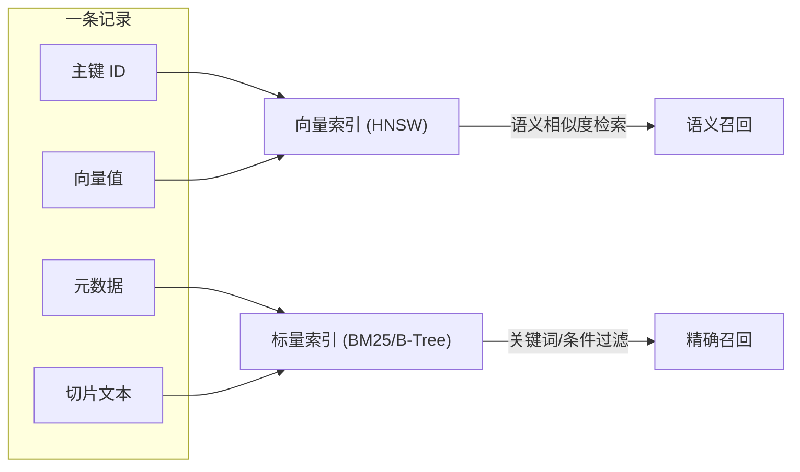

很多人把向量数据库当黑盒用——文档切块，跑一下 Embedding 模型，往里一塞，检索时算个余弦相似度，完事。但如果我问你：向量数据库里一条记录到底存了哪些东西？除了向量值本身，还有什么？为什么混合检索能同时做语义匹配和关键词过滤？

要理解这些，得把向量数据库拆开看。

## 一条记录的四要素

向量数据库里的一条记录（Record / Point / Entity），不是一个孤零零的向量数组，而是一个多维复合存储结构。无论你用 Qdrant、Pinecone 还是 pgvector，拆开看都有四个核心组成部分：

| 组成部分 | 存什么 | 作用 |
|----------|--------|------|
| **主键 (ID)** | 唯一标识符（整数或 UUID） | 定位记录，去重、更新、删除的依据 |
| **向量值 (Vector / Embedding)** | 高维浮点数组（如 1536 维） | 语义的"空间坐标"，用于计算余弦相似度 |
| **原始文本 (Payload / Content)** | 切片本身——切块后的文本 | 检索命中后塞给 LLM 当上下文 |
| **元数据 (Metadata)** | JSON 键值对（如 `doc_id`、`page`、`category`） | 标量过滤属性，支持 `WHERE` 式精准筛选 |

一个关键认知：**向量 ≠ 切片**。向量是切片的数学投影——你把一段文本丢进 Embedding 模型，得到一串数字，这串数字能用来算"语义距离"。但向量本身不是文本，检索命中后要喂给 LLM 的是原始切片文本，不是那串数字。二者存在同一条记录里，职责完全不同。

### 在 pgvector 中的样子

pgvector 的做法最直观——它就是 PostgreSQL 的一个扩展，往普通表里加一个 `vector` 类型列：

```sql
CREATE TABLE chunks (
    id        bigserial PRIMARY KEY,          -- 主键
    embedding vector(1536),                    -- 向量值
    content   text,                            -- 原始切片文本
    doc_id    text,                            -- 元数据：来源文档
    page      int,                             -- 元数据：页码
    category  text,                            -- 元数据：分类
    created_at timestamptz default now()       -- 元数据：时间
);
```

一行 = 一条记录。`embedding` 列存向量值，`content` 列存切片文本，`doc_id`/`page`/`category` 等列就是 Metadata。业务数据和向量在同一个表里，天然支持 ACID 事务——这是 pgvector 相比独立向量库的核心优势。

> pgvector v0.8.6 支持单精度、半精度、二进制和稀疏向量，以及 L2 距离、内积、余弦距离、L1 距离、汉明距离和 Jaccard 距离。[来源：pgvector GitHub](https://github.com/pgvector/pgvector)

## 后台的双索引引擎

除了数据本身，向量数据库后台还维护着两套索引引擎。理解这两套引擎，才能理解混合检索为什么能同时做语义匹配和关键词过滤。



### 1. 向量索引（如 HNSW）

HNSW（Hierarchical Navigable Small World）在向量空间中建立类似"高速公路网"的图结构。检索时先在"主干道"上大跨步定位到大致区域，再逐步下沉到"小巷子"寻找最近的几个邻居，把全表扫描的 O(N) 降到平均 O(log N)。

这套索引只管一件事：**算语义距离**。用户问"性能优化"，它能找到语义相近的"延迟降低"。

### 2. 标量索引（Full-text / B-Tree）

用于对 Metadata 或切片文本进行全文检索（BM25）或精确匹配。这是混合检索中 FTS 通道的底层支撑。

这套索引也只管一件事：**精确过滤**。用户搜 `useSearchParams`，它能精准命中包含这个函数名的切片，不管向量空间里它们离多远。

两套引擎各管各的，混合检索就是把两路结果各取 Top-K，然后用 RRF 等算法融合排名。这正是理解向量数据库记录结构的核心价值——**Metadata 不是可有可无的附属品，它是标量索引的输入，是混合检索的基础设施**。

## 各家向量数据库的记录结构对比

不同向量数据库用不同术语，但四要素的模式一致：

| | 主键 | 向量值 | 原始文本/荷载 | 元数据 |
|---|------|--------|-------------|--------|
| **Qdrant** | `id`（int 或 UUID） | `vector` | 包含在 `payload` 中 | `payload`（JSON） |
| **Pinecone** | `id`（string） | `values` | 不直接存储，外部维护 | `metadata`（JSON） |
| **pgvector** | 表主键（如 `bigserial`） | `vector` 类型列 | `text` 列 | 表中其他列 |
| **Milvus** | 主键字段 | 向量字段 | 标量字段 | 标量字段 |

Qdrant 把切片文本和元数据都塞进 `payload` 里，Pinecone 只存 `metadata` 不存原始文本（需要你外部维护映射），pgvector 最直接——一切都是表里的列。

> Qdrant 官方文档：A point is a record consisting of a vector and an optional payload。[来源：Qdrant Points 文档](https://qdrant.tech/documentation/concepts/points/)

## 为什么理解这个结构很重要

### 1. 理解混合检索的物理基础

混合检索不是黑魔法。它就是同时利用向量索引（语义）和标量索引（关键词/条件），各自召回后融合。如果你不理解一条记录里有向量值和 Metadata 两个独立可索引的部分，混合检索就像变魔术。

### 2. 理解 RAG 的写入成本为什么低

切片 RAG 写入时只需要：文本切块 → 跑 Embedding 模型 → 插入一行数据。没有额外的结构化提炼、没有人工审核、没有双链关联计算。这就是切片 RAG"即插即用"的物理基础——写入成本极低，因为一条记录的结构足够简单。

### 3. Metadata 设计的价值

好的 Metadata 设计（如 `doc_id`、`page`、`category`、`tags`）能让标量过滤大幅缩小检索范围。比如先 `WHERE category = 'api'` 过滤到 50 条，再在这 50 条里做向量检索，比在 10 万条全表扫描快得多。而如果 Metadata 设计不当——忘了加列、没建索引——混合检索的标量通道就形同虚设。

## 参考

- [Qdrant Points 文档](https://qdrant.tech/documentation/concepts/points/) — Qdrant 中 point 的定义与结构
- [pgvector GitHub v0.8.6](https://github.com/pgvector/pgvector) — pgvector 向量类型、距离运算、索引支持
- [Pinecone Upsert 文档](https://docs.pinecone.io/guides/data/upsert-records) — Pinecone 记录的 upsert 结构
- Malkov & Yashunin, "Efficient and robust approximate nearest neighbor search using Hierarchical Navigable Small World graphs" (2018) — HNSW 算法论文
