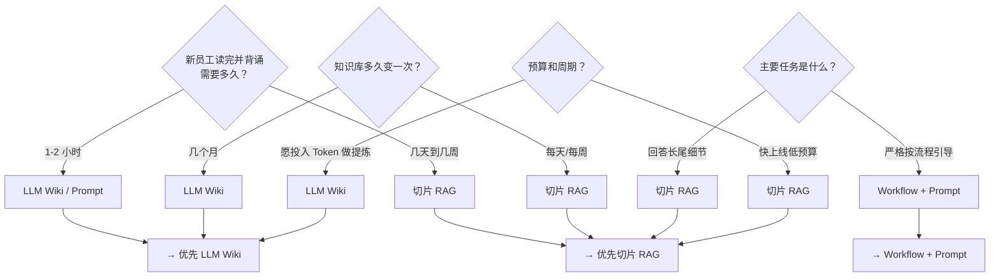

很多人搭 AI 助手时遇到的第一个岔路口：知识该用切片 RAG 存，还是用 LLM Wiki 存？网上答案五花八门——有人说 RAG 是标配，有人说 LLM Wiki 才是未来。其实问"谁更好"本身就有问题，正确的问法是：**你的数据是什么形态？**

## 前提：先搞清你的数据是什么类型

在选型之前，得先分清一件事：你的知识是"结构化"还是"非结构化"的。

区分标准不是"有没有排版格式"，而是**计算机能否直接用代码做逻辑判断**：

| 类型 | 特征 | 例子 | 计算机能直接处理吗 |
|------|------|------|-------------------|
| **结构化** | 有严格固定的字段 | 数据库 `user(age: INT, balance: DECIMAL)` | ✅ 直接 `WHERE balance > 100` |
| **非结构化** | 靠自然语言承载语义 | PDF、合同、法条、日志 | ❌ 需要 LLM 理解语义 |
| **半结构化** | 有排版/标签但字段不可控 | HTML、带章节编号的法条 | ⚠️ 需先解析再判断 |

容易混淆的是法条——有"第一章、第一条、第(一)款"，看起来很有结构。但这只是**排版结构**，数据处理层面依然是非结构化的。法条写"因不可抗力导致合同无法履行的，根据影响程度免除责任"——计算机没法直接写 `WHERE 责任 = 免除`，"不可抗力"和"影响程度"的语义必须靠人来推断。

> 一句话：排版结构 ≠ 数据结构。有目录有编号只是"排版好看"，计算机能直接 `WHERE` 查询的才是"结构化数据"。

知识库架构选型的本质，就是回答：**你的非结构化数据，适合"入库时预提炼"（LLM Wiki）还是"检索时切片捞"（RAG）？**

## 三维度评估"海量"

"海量"不是看你文件占了几 GB，而是从三个维度综合判断：

| 维度 | "非海量"（适合 LLM Wiki / Prompt） | "海量 / 动态"（适合切片 RAG） |
|------|-------------------------------------|-------------------------------|
| **1. 物理规模** | < 10 万字（几本手册、十几张 SOP） | > 50~100 万字（上千条 SKU、几十本合规条文） |
| **2. 更新频率** | 极低（业务流程半年变一次） | 高频 / 每天变（商品价格、库存、每日促销） |
| **3. 业务复杂度** | 强逻辑链、步骤固定（第一步→第二步→第三步） | 弱排列组合、长尾查询（"A 款和 B 款针对 50 岁以上用户的税率差异"） |

一个关键认知：10 万字的 SOP 文档虽然文件不小，但逻辑清晰、更新频率低，属于"非海量精炼型"，适合 LLM Wiki。反过来，5000 条商品描述虽然单条只有几百字，但每天在变、组合关系复杂，这是真正的"海量"，适合切片 RAG。

## 选型决策树

把三个维度变成四个实际问题，逐一回答就能定位：

四个问题不需要全部选 A 或全部选 B。实际情况往往是混合：核心流程知识选 A（LLM Wiki），长尾细节知识选 B（RAG）。这就要看下面这个关键纠偏。

## 纠正一个常见误区

很多人以为切片 RAG 的优势是"检索质量高"。恰恰相反——切片 RAG 在全局性问题上检索质量不如 LLM Wiki（切片碎片化、跨文档推理弱）。**切片 RAG 真正的不可替代优势是写入成本极低。**

| | 切片 RAG | LLM Wiki |
|---|---------|---------|
| **写入成本** | ⚡ 极低（切块→Embed→入库，几分钟） | 🐢 较高（LLM 提炼+分类+建链，耗时且花 Token） |
| **检索全局性** | 弱（碎片化，跨文档易断章取义） | 强（预提炼，概念清晰，推理精准） |
| **适合规模** | 海量、动态、TB 级 | 精炼、强逻辑、中小规模 |

### 切片 RAG 不可替代的三个场景

**场景 1：海量文档即插即用**
公司刚拿到 5000 份 PDF 合同，要求下午上线问答助手。切片 RAG 用 Python 脚本几分钟搞定。LLM Wiki 方案让大模型逐一阅读并提炼 5000 份合同，光 API Token 费就上万。

**场景 2：高频动态更新**
客服知识库、实时新闻、代码库的 Git Commit。新增一条数据，切片 RAG 直接 Embed 插入即可。LLM Wiki 每次新增知识都需要重新计算它与原有所有概念的双链关联，维护成本极高。

**场景 3：保留原始上下文细节**
查具体的代码报错信息或硬件参数规范——"ERR_404_NULL_POINTER 在第 340 行的精准调用"。切片保留了原始文本的每一个标点符号，配合混合检索能精准按原句召回。LLM Wiki 在"预提炼"时可能会将这些长尾细节抹去。

## 一句话带走

- **数据海量、动态更新、长尾查询多** → 切片 RAG（写入成本极低是核心优势）
- **数据精炼、逻辑递进、全局检索** → LLM Wiki（预提炼换取检索质量）
- **二者不是对立，可以并存**——核心知识走 LLM Wiki，海量细节走 RAG
