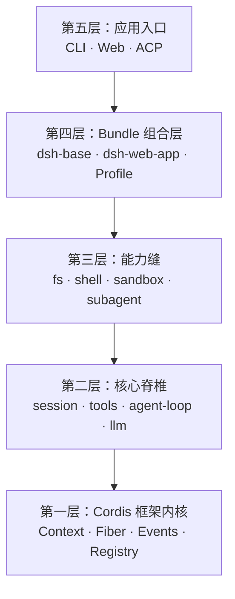
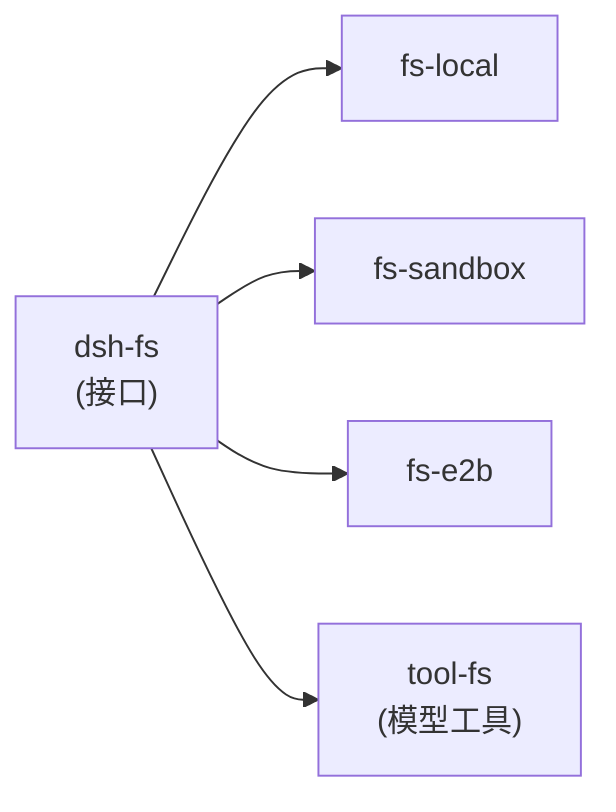

> 把 DeepSeek Harness 比作操作系统：Cordis 是内核，ctx 是系统调用表，能力缝是设备驱动接口，Session 事件日志是文件系统，Agent Loop 是进程调度器，插件是可加载的内核模块。

## 五层结构总览

DeepSeek Harness 从下到上分五层：



## 第一层：Cordis 框架内核

Cordis 是 vendored 的插件框架（源自 [cordiverse/cordis](https://github.com/cordiverse/cordis)），提供五个核心机制：

- **Context**：Proxy 包装的服务容器。`ctx.tools` 不是属性读取，而是一次服务查找——已注册服务走 isolate key，未激活走 fiber 父链。
- **Fiber**：插件生命周期单元。状态机 `PENDING → LOADING → ACTIVE → UNLOADING → DISPOSED`，`ctx.effect()` 注册的副作用随 Fiber 销毁逆序回滚。
- **Events**：五种派发模式（emit / parallel / serial / bail / waterfall）。waterfall 是链式中间件，工具执行管道就建立在它之上。
- **Registry**：插件注册表，一个插件可以是函数、构造函数或对象。
- **Reflect**：服务发现与代理，`provide()` 注册服务并唤醒依赖它的 pending fiber。

**epoch 机制**是热重载的基础：依赖服务的 fiber uid 组合成 epoch 字符串，epoch 变化触发插件自动重载。服务 B 被替换，依赖它的插件 A 自动重载，不需要重启。

## 第二层：核心脊椎（Agent 循环）

这是 dsh 独有的代码。七个核心包构成完整循环：

- **Session**：append-only 事件溯源日志，对话是投影而非存储。
- **System Prompt**：section / context / variable / tools 四类贡献的组装器。
- **Tools**：`pre-execute → guard → execute → post-execute` 瀑布流执行管道。
- **Agent**：对外统一接口（followup / steer / inject / cancel）。
- **Agent-Loop**：`kick → turn → step` 三层驱动循环。
- **Scope**：零依赖作用域原语，全局/局部影子覆盖。
- **LLM**：模型适配缝（Message / ContentBlock / StreamChunk + adapter）。

### 事件溯源 Session：Surface 投影

只有三种事件（`user/message`、`assistant/message`、`tool/result`）携带 `surfaceOp`，构成有序「表面」。`deriveMessages()` 把表面投影为 `Message[]`。上下文压缩通过 `surfaceOp: { op: 'replace' }` 把一段表面替换为摘要节点，从投影中「消失」旧消息。

### 工具执行管道

```
参数物化 → tools/pre-execute（allow/deny/ask）
  → monotonic guards → tools/execute（waterfall）
  → tools/post-execute → finalizeContent → tools/result
```

并发调度：`isConcurrencySafe` 为 true 的进并行池，false 的形成排他屏障。

## 第三层：能力缝（Capability Seams）

每个能力缝是「Service Definition + Provider + Consumer」三角色结构：



切换 Provider 从 local 到 e2b，所有文件操作自动迁移到远程沙箱，工具代码不变。请求/规范分离是通用模式：Consumer 提交请求，Provider `resolve()` 为具体规范再 `run()`。

## 第四层：Bundle 组合层

Profile 声明 bundles，多层 `cordis.patch.yml` 依次叠加：

```
dsh-base 基础行 → dsh-web-app 覆盖 → profile 补丁 → home 补丁 → CLI --patch
```

每个 patch 按 `id` 定位已有行替换，或 `insert` 新行。最终形成一棵插件树。

## 第五层：应用入口

- **dsh CLI**：`dsh` 交互终端、`dsh web` 启动 Web、`dsh --profile headless "task"` 无头执行。
- **ACP 服务器**：JSON-RPC over stdio，支持自动化集成。
- **Web 前端**：Vite + React 18，dsh-client-web 内核 + dsh-client-ui-* 插件集。

## 设计哲学

1. **事件溯源是唯一真相**：不存对话，存事件流；fork、resume、压缩、回放都是日志操作。
2. **一切皆插件，包括循环本身**：agent-loop 是可替换插件，不是特权核心。
3. **能力缝三角色完备**：定义 / 实现 / 消费分离，用包结构强制建筑约束。
4. **注册即副作用**：Fiber effect 自动回滚，热重载与优雅关闭是设计内置的。

## 一句话带走

DeepSeek Harness 用「插件框架 + 事件溯源 + 能力缝」三层结构，把 Agent 运行时做成了一个可组合、可替换、可审计的微型操作系统。

## 参考来源

- [cordiverse/cordis](https://github.com/cordiverse/cordis) — 第一层框架内核
- [deepseek-ai/deepseek-harness](https://github.com/deepseek-ai/deepseek-harness) — 本文分析对象
