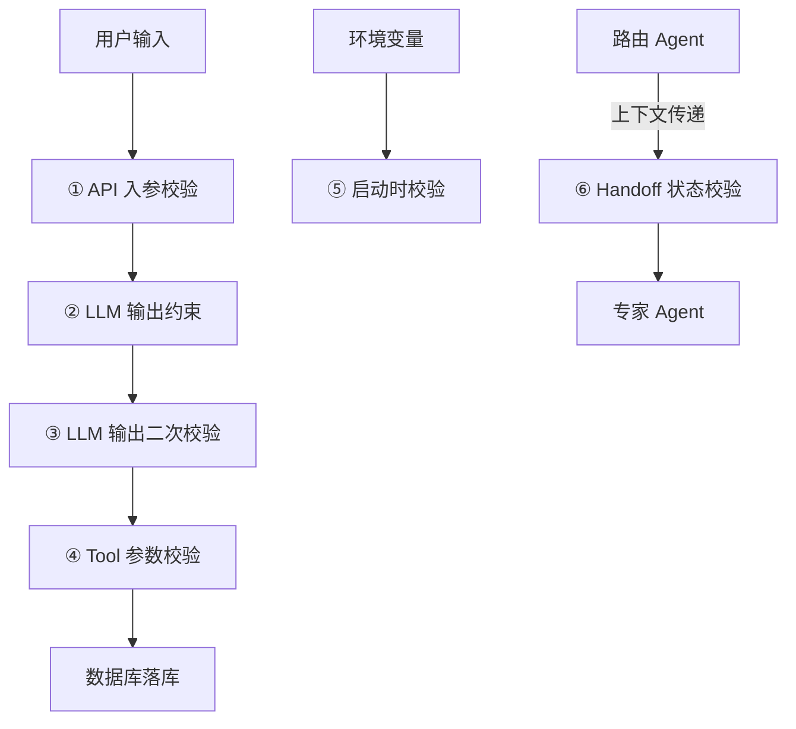
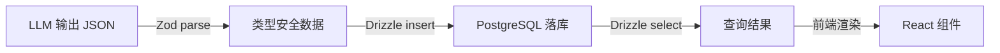

# 2026-08-09 Zod 全生命周期：Agent 全链路的 6 个校验场景

你可能只用 Zod 校验 LLM 输出。但在一个完整的 Agent 系统里，Zod 至少出现在 6 个环节——从 API 入参到环境变量，从 Tool 参数到 Handoff 状态传递。漏掉任何一个，就是一道敞开的门。

## 为什么 Zod 不只是"LLM 输出质检员"

大多数人认识 Zod，是通过 Vercel AI SDK 的 `generateObject({ schema })` 或 OpenAI SDK 的 `zodResponseFormat`。但这只是 Zod 6 个角色中的 1 个。

Zod 的本质是**运行时数据校验库**——它不关心数据从哪来，只关心数据符不符合你定义的结构。在 Agent 全链路中，动态数据来自四面八方：用户输入、LLM 输出、Tool 参数、环境变量、Agent 间传递的上下文。每一处都需要校验。

## 6 个角色逐个拆解

### 角色 1：API 入参校验（后端防伪门卫）

```typescript
import { z } from 'zod';

// Next.js Route Handler 的第一道防线
const CreateNoteSchema = z.object({
  title: z.string().min(1).max(200),
  content: z.string().min(1),
  category: z.enum(['study', 'work', 'personal']).default('study'),
});

export async function POST(req: Request) {
  const body = await req.json();
  const parsed = CreateNoteSchema.safeParse(body);
  if (!parsed.success) {
    return Response.json({ error: parsed.error.issues }, { status: 400 });
  }
  // parsed.data 已是类型安全的数据
}
```

**职责**：拦截客户端传来的非法 Payload——空标题、超长内容、非法枚举值。确保进入业务逻辑和写库的数据 100% 安全。

### 角色 2：LLM 输出约束（定义预期返回结构）

```typescript
import { generateObject } from 'ai';
import { openai } from '@ai-sdk/openai';

const { object } = await generateObject({
  model: openai('gpt-4o'),
  schema: StudyDiagnosisSchema,  // Zod Schema 被 SDK 转为 JSON Schema 传给 LLM
  system: '你是一位学习导师...',
  prompt: `笔记内容：${notes}`,
});
```

**职责**：提供 TypeScript 强类型的字段定义，被 AI SDK 转换为 JSON Schema 注入给 LLM。底层触发 Grammar-Guided Sampling，物理层保证输出合规。详见 [Structured Output](../concept/agent/2026-08-09_概念_StructuredOutput.md)。

### 角色 3：LLM 输出二次校验（运行期兜底）

大模型返回 JSON 文本后，Zod 在运行期执行 `schema.parse(llmOutput)`。即使大模型偶发性地漏写字段，Zod 能第一时间抛出明确错误，防止脏数据进入系统后台。

```typescript
// generateObject 内部已自动执行 parse，但如果手动调用 LLM API：
const raw = await openai.chat.completions.create({...});
const result = StudyDiagnosisSchema.parse(JSON.parse(raw.choices[0].message.content));
// 不合规直接抛 ZodError，不会静默放行
```

**职责**：二次防线。Grammar-Guided Sampling 已经物理层保证合规，Zod parse 是"信任但验证"的兜底机制。

### 角色 4：Tool / Function Calling 参数

```typescript
import { tool } from 'ai';
import { z } from 'zod';

const createStudyPlanTool = tool({
  description: '为用户创建学习计划',
  parameters: z.object({
    days: z.number().min(1).max(365).describe('学习天数'),
    topic: z.string().describe('学习主题'),
  }),
  execute: async ({ days, topic }) => {
    // days 一定是 1-365 的数字，LLM 传 "五天" 会被拦截
    return generatePlan(topic, days);
  },
});
```

**职责**：定义 Agent 可调用工具的参数格式。LLM 决定调用 Tool 时，参数必须先过 Zod 校验，脏参数直接拒绝。

### 角色 5：环境变量校验

```typescript
import { z } from 'zod';

const envSchema = z.object({
  OPENAI_API_KEY: z.string().startsWith('sk-'),
  DATABASE_URL: z.string().url(),
  NODE_ENV: z.enum(['development', 'production', 'test']),
});

const env = envSchema.parse(process.env);
// 应用启动时立即校验，避免线上运行到一半才发现配置缺失
```

**职责**：应用启动时校验 `process.env` 是否存在且格式正确。如果 `OPENAI_API_KEY` 缺失或格式不对，应用直接拒绝启动，而不是运行到第一次调用 LLM 时才崩溃。

### 角色 6：Handoff 状态传递

```typescript
import { z } from 'zod';

// 多 Agent 架构中，主 Agent 向子 Agent 传递上下文
const HandoffContextSchema = z.object({
  userId: z.string(),
  conversationSummary: z.string(),
  currentTopic: z.string(),
  pendingTasks: z.array(z.string()),
  metadata: z.record(z.unknown()).optional(),
});

function handoffToSpecialist(context: unknown) {
  const ctx = HandoffContextSchema.parse(context);
  // 上下文数据包完整，可以安全传递给专家 Agent
}
```

**职责**：多 Agent 架构中，主 Agent 向子 Agent 传递 Context 时校验数据包是否完整。Handoff 是状态所有权的交接，上下文残缺会导致子 Agent 无法正常工作。

## 6 个角色全览



## 跨生态映射：每个语言生态都有自己的 Zod

Zod 是 TypeScript 生态的方案，但不是唯一的方案。每种语言生态都有自己的运行时数据校验库：

| 生态 | Schema 方案 | 对应角色 | 典型用法 |
|------|-----------|---------|---------|
| TypeScript / Node.js | **Zod**（同类：Valibot, TypeBox） | 运行时校验 + 类型推导 | `z.object({...}).parse(data)` |
| Python | **Pydantic** | 数据模型 + 校验 | `class Model(BaseModel): ...` |
| Java | Hibernate Validator / JSR-303 | 注解式校验 | `@NotNull @Size(min=1)` |

三者做的事情本质相同：在运行时拦截不符合 Schema 的数据。差异在于语言范式——Zod 是声明式 API，Pydantic 是类继承，Hibernate Validator 是注解装饰。

## Zod vs Drizzle Schema：职责边界

这是最容易混淆的一组。两者都叫"Schema"，但管的东西完全不同：

| | Zod | Drizzle Table Schema |
|--|-----|---------------------|
| **约束对象** | 动态数据（LLM 输出、用户输入、API 参数） | 数据库表结构（每条数据的字段类型） |
| **角色比喻** | 门卫 / 质检员 | 建模师 / 施工图 |
| **生效时机** | 运行时，每次数据通过都校验 | 定义时，决定表结构 |
| **类型来源** | Zod 定义 → `z.infer<typeof Schema>` 推导 | Drizzle 定义 → TS 类型自动生成 |
| **关心什么** | 数据"形状"对不对 | 数据"怎么存" |

**两者的结合**：LLM 生成 → Zod 校验通过 → Drizzle `db.insert(...)` 写入 PostgreSQL，实现端到端类型安全（End-to-End Type Safety）。



## 性能注意事项

Zod 的 `parse()` 是同步操作，对于大多数 Schema（几十个字段以内）性能开销可忽略。但在以下场景需要注意：

- **超大 Schema**（几百个字段嵌套）：`parse()` 可能耗费数毫秒，在高 QPS 场景下需要评估
- **流式输出**：Vercel AI SDK 的 `streamObject` 在流式过程中增量校验，不会等全部生成完才 parse
- **`safeParse` vs `parse`**：`safeParse` 不抛异常，返回 `{ success, data, error }`，适合需要自定义错误处理的场景

## 适用边界

| 场景 | 用 Zod？ | 原因 |
|------|---------|------|
| LLM 输出 | ✅ | LLM 是概率性的，必须校验 |
| 用户 API 输入 | ✅ | 不可信数据源 |
| Tool 参数 | ✅ | LLM 决定调用参数，可能不合规 |
| 环境变量 | ✅ | 启动时一次性校验，成本极低 |
| 数据库查询结果 | ❌ | Drizzle 已保证类型安全，不需要 Zod 再校验 |
| 内部函数间传参 | ❌ | 可信数据源，Zod 校验是多余的 |
| Handoff 上下文 | ✅ | Agent 间传递的上下文可能不完整 |

## 一句话带走

Zod 是动态数据的门卫——不管数据来自用户输入、LLM 输出、Tool 参数还是环境变量，只要是动态生成的，就需要 Zod 在边界做校验。

## 参考来源

- [Zod 官方文档](https://zod.dev) — Schema 定义 API、`.parse()` / `.safeParse()` / `z.infer`
- [Vercel AI SDK generateObject](https://ai-sdk.dev/docs/reference/ai-sdk-core/generate-object) — `schema` 参数与底层转换
- [Pydantic 官方文档](https://docs.pydantic.dev) — Python 生态对应方案
- [Hibernate Validator 文档](https://docs.jboss.org/hibernate/stable/validator/reference/en-US/html_single/) — Java 生态对应方案

## 相关

- [Structured Output](../concept/agent/2026-08-09_概念_StructuredOutput.md) — Zod Schema 如何转为 JSON Schema 约束 LLM
- [Agent 数据库设计](./2026-08-09_方法_Agent数据库设计.md) — Zod 校验通过后数据如何落库
- [Agent 全栈技术栈](../concept/agent/2026-08-09_概念_Agent全栈技术栈.md) — Zod 在四层架构中的位置
